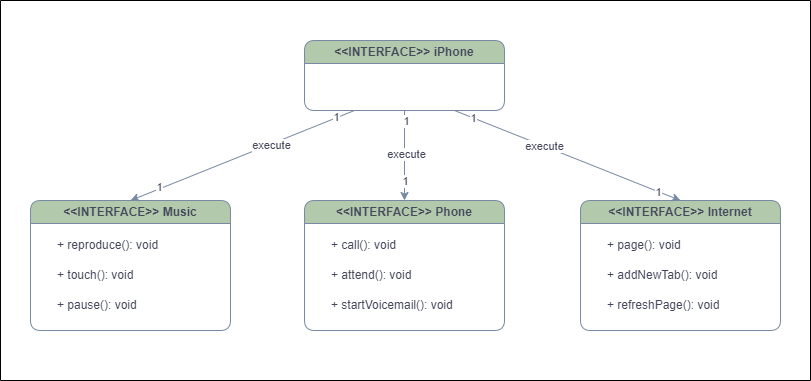

 <div align="center">

<h1>Orientação a Objetos e UML: Diagramação de Classes do iPhone</h1> 
 </div>

## UML (Unified Modeling Language) é uma linguagem visual amplamente utilizada para projetar, modelar e documentar sistemas de software. Ele fornece uma variedade de diagramas gráficos que ajudam a visualizar a estrutura, o comportamento, os relacionamentos e as interações entre os componentes do sistema. Um dos diagramas mais comuns é o diagrama de classes, cujo objetivo é modelar a estrutura de classes em um sistema de software. Ele fornece uma representação visual de classes, seus atributos, métodos e relacionamentos.

## <div align="center">DIAGRAMA DO PROJETO</div>
<div align="center">

</div>

### Diagrama de representação das classes dos app´s musica, telefone e internet, onde eles tem a relação de 1:1 e o iPhone é capaz de execultar cada um deles.

## OBS: No diretorio ```src``` se encontra o codigo em que esse diagrama representa.

### 🧑🏾‍💻 Autor
#### Rommel Santhiago
https://www.linkedin.com/in/rommelsanthiago

rommel.santhiago@gmail.com
